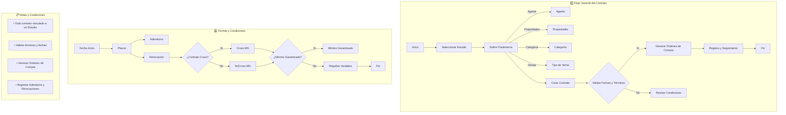

```mermaid
flowchart TD
  
    subgraph FlujoGeneral["1️⃣ Flujo General del Contrato"]
        A[Inicio] --> B[Seleccionar Estudio]
        B --> C[Definir Parámetros]
        C -->|Agente| D1[Agente]
        C -->|Propiedades| D2[Propiedades]
        C -->|Categoría| D3[Categoría]
        C -->|Ventas| D4[Tipo de Venta]
        C --> E[Crear Contrato]
        E --> F{Validar Fechas y Términos}
        F -->|Sí| G[Generar Órdenes de Compra]
        F -->|No| H[Revisar Condiciones]
        G --> I[Registro y Seguimiento]
        I --> J[Fin]
    end

    %% ===========================
    %% 3. FECHAS Y CONDICIONES
    %% ===========================
    subgraph FechasCondiciones["3️⃣ Fechas y Condiciones"]
        P[Fecha Inicio] --> Q[Plazos]
        Q --> R[Adendums]
        Q --> S[Renovación]
        S --> T{¿Contrato Cross?}
        T -->|Sí| U[Cross MG]
        T -->|No| V[NoCross MG]
        U --> W{¿Mínimo Garantizado?}
        V --> W
        W -->|Sí| X[Mínimo Garantizado]
        W -->|No| Y[Regalías Variables]
        Y --> Z[Fin]
    end

    %% ===========================
    %% NOTAS
    %% ===========================
    subgraph Notas["📋 Notas y Condiciones"]
        N1["• Todo contrato vinculado a un Estudio"]
        N2["• Validar términos y fechas"]
        N3["• Generar Órdenes de Compra"]
        N4["• Registrar Adendums y Renovaciones"]
    end

```
