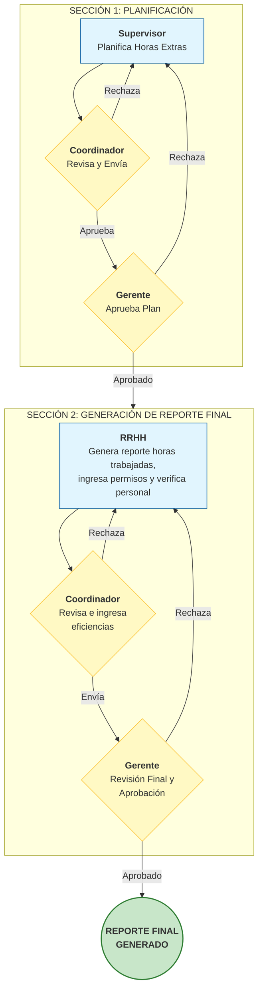

```mermaid
graph TD;
    %% Estilos
    classDef actor fill:#f9f9f9,stroke:#333,stroke-width:2px;
    classDef process fill:#e1f5fe,stroke:#01579b,stroke-width:1px;
    classDef decision fill:#fff9c4,stroke:#fbc02d,stroke-width:1px;
    classDef final fill:#c8e6c9,stroke:#2e7d32,stroke-width:2px;

    subgraph SECCION_1 [SECCIÓN 1: PLANIFICACIÓN]
        S1[<b>Supervisor</b><br/>Planifica Horas Extras] --> C1{<b>Coordinador</b><br/>Revisa y Envía}
        C1 -- Rechaza --> S1
        C1 -- Aprueba --> G1{<b>Gerente</b><br/>Aprueba Plan}
        G1 -- Rechaza --> S1
    end

    G1 -- Aprobado --> SECCION_2

    subgraph SECCION_2 [SECCIÓN 2: GENERACIÓN DE REPORTE FINAL]
        R1[<b>RRHH</b><br/>Genera reporte horas trabajadas,<br/>ingresa permisos y verifica personal] --> C2{<b>Coordinador</b><br/>Revisa e ingresa<br/>eficiencias}
        C2 -- Rechaza --> R1
        C2 -- Envía --> G2{<b>Gerente</b><br/>Revisión Final y<br/>Aprobación}
        G2 -- Rechaza --> R1
    end

    G2 -- Aprobado --> Fin((<b>REPORTE FINAL<br/>GENERADO</b>))

    %% Asignación de clases
    class S1,R1 process;
    class C1,G1,C2,G2 decision;
    class Fin final;
```
